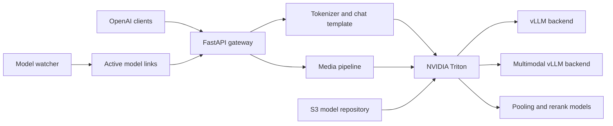

# Triton OpenAI Gateway

<div align="center">

**Language:** English | [Русский](README.ru.md)

**OpenAI-compatible APIs and multimodal orchestration for NVIDIA Triton and vLLM.**

[](LICENSE)
[](https://github.com/Raytorin/triton-openai-gateway/actions/workflows/ci.yml)
[](https://github.com/triton-inference-server/server)
[](https://github.com/vllm-project/vllm)
[](https://www.python.org/)
[](https://github.com/Raytorin)

[At a glance](#at-a-glance) · [Why this project](#why-this-project) · [Features](#features) · [Quick start](#quick-start) · [Documentation](#documentation) · [Author](#author) · [Security](#security)

</div>

Triton OpenAI Gateway runs next to NVIDIA Triton Inference Server and exposes a
practical OpenAI-compatible API on port `8080`. It applies each model's chat
template, translates tool calls, handles large multimodal inputs, and adds
backpressure and observability without replacing Triton's model lifecycle or
vLLM scheduler.

Use it when Triton is already your inference runtime, but clients such as
LiteLLM, LibreChat, OpenAI SDKs, or internal applications need a consistent API
for chat and non-chat models.

> This is an independent community project. It is not an NVIDIA product and is
> not affiliated with or endorsed by NVIDIA.

> [!NOTE]
> This repository provides gateway, backend, and deployment code. It does not
> include model weights, execute external tools, or provide user
> authentication.

> **Found this project useful?** Consider giving it a GitHub Star. It helps
> other developers discover the project and supports its continued development.

## At A Glance

| Area | Included |
| --- | --- |
| Client compatibility | OpenAI-style API for LiteLLM, LibreChat, SDKs, and internal clients |
| Model roles | Text/VL chat, embeddings, and reranking |
| Multimodal inputs | Images, video, audio, and PDF with bounded preprocessing |
| Runtime | NVIDIA Triton `26.07`, vLLM `0.24.0`, and Python `3.12` |
| Operations | Admission queues, cancellation, structured logs, Prometheus metrics, and OTLP traces |
| Deployment | Digest-pinned Docker build and Kubernetes Helm charts |

## Why This Project

Raw Triton inference endpoints are deliberately model-oriented. Production LLM
clients usually need additional protocol and orchestration behavior:

| Gap | What the gateway adds |
| --- | --- |
| vLLM receives a rendered prompt | OpenAI `messages` plus the tokenizer's native chat template |
| Tool output may be model-specific JSON or XML | OpenAI-compatible `tool_calls`, including Qwen3-Coder XML |
| Media does not fit one universal Triton input | Image, video, audio, and PDF routing with bounded preprocessing |
| Long PDFs and videos exceed one prompt | Text-first extraction, chunked map/reduce, and optional PDF retrieval |
| Long conversations exceed the model context | Per-model rolling summaries, deterministic truncation, or explicit rejection |
| Rerank consumers need different cut-off rules | Named score, metadata, threshold, and diversity selection strategies |
| Reasoning models mix thought and answer text | Configurable hidden or separate reasoning fields for JSON and SSE |
| Unbounded client traffic can exhaust the pod | Per-route admission queues, timeouts, cancellation, and HTTP `429` |
| Logs alone do not show the request path | Request IDs, structured logs, Prometheus metrics, and optional OTLP traces |
| S3 repository agents materialize temporary paths | A watcher repairs vLLM model paths and maintains active model links |

## Architecture



Triton, the watcher, and the gateway run in one container. Model execution and
continuous batching remain inside Triton/vLLM; the gateway only owns the client
protocol, prompt rendering, media orchestration, and request controls.

## Features

- `POST /v1/chat/completions`, including SSE streaming and client cancellation.
- OpenAI function calling with JSON and Qwen3-Coder XML response parsing.
- `POST /v1/embeddings` for vLLM pooling models.
- `POST /rerank`, `/v1/rerank`, and `/v2/rerank` for Triton rerank models.
- Image, video, audio, and PDF content parts in OpenAI-style messages.
- Long-document and long-video map/reduce with configurable limits.
- Optional embedding retrieval for text PDFs.
- Per-model context overflow policies with rolling summaries and bounded fallback.
- Configurable rerank selection after every candidate has been scored by the model.
- Reasoning policies for hidden or separately returned model reasoning.
- Bounded global and per-route admission queues.
- JSON, CEF, or text logs with `X-Request-ID` correlation.
- Gateway, Triton, vLLM, GPU/MIG, and OpenTelemetry integration points.
- Explicit model load/unload with S3-backed Triton repositories.
- A custom `vllm_multimodal` backend for native vLLM media inputs.

The gateway **does not execute tools**. Your application executes the function
returned in `tool_calls`, then sends its result back as a `role: "tool"`
message.

## Compatibility

| Capability | Triton `vllm` | Included `vllm_multimodal` | Python backend |
| --- | --- | --- | --- |
| Text chat and streaming | Yes | Yes | Model-specific |
| Tool calling | Gateway layer | Gateway layer | Model-specific |
| Images | Native vLLM input | Native vLLM input | Model-specific |
| Video | Gateway samples and summarizes frames | Native when the model supports video | Model-specific |
| PDF | Gateway text/vision map-reduce | Gateway map-reduce; direct calls render pages | Model-specific |
| Audio | Local ASR before chat | Native when the model supports audio | Model-specific |
| Embeddings | Yes | Yes | Yes |
| Reranking | Model-specific | Model-specific | Yes |

Native modality support still depends on the selected model architecture and
the bundled vLLM version. For example, a vision-only model cannot process audio
without a separate ASR model.

## Quick Start

### Prerequisites

- A Linux host or Kubernetes node with a supported NVIDIA GPU.
- NVIDIA driver and Container Toolkit or GPU Operator.
- Docker for image builds; Helm 3 for the provided Kubernetes chart.
- A Triton model repository. Model weights are not included in this repository.

### 1. Build The Image

The default base image is digest-pinned to Triton `26.07-vllm-python-py3`.

```bash
docker build \
  -f Dockerfile.triton-gateway \
  -t triton-openai-gateway:26.07 .
```

All added Python dependencies are version-pinned and verified during the build.

### 2. Prepare A Model

The S3/remote repository flow expects the standard Triton layout:

```text
model-repository/
└── Qwen3-Example/
    ├── config.pbtxt
    └── 1/
        ├── model.json
        ├── gateway.json        # optional gateway-only settings
        ├── config.json
        ├── tokenizer_config.json
        └── model weights...
```

Do not put gateway-only keys in `model.json`; vLLM treats its keys as engine
arguments. See [Configuration](docs/configuration.md) and the
[multimodal model examples](examples/).

### 3. Run With Triton

Provide the repository credentials expected by Triton's repository agent in an
environment file, then start the combined image:

```bash
docker run --rm --gpus all --shm-size=8g \
  --env-file .env \
  -p 8000:8000 -p 8001:8001 -p 8002:8002 -p 8080:8080 \
  triton-openai-gateway:26.07 \
  tritonserver \
  --model-repository=s3://S3_ENDPOINT/BUCKET/PREFIX \
  --model-control-mode=explicit \
  --strict-readiness=false
```

For Kubernetes, use the bundled chart instead:

```bash
helm upgrade --install triton-openai-gateway ./helm/triton-gateway \
  --namespace inference --create-namespace \
  --set image.repository=REGISTRY/triton-openai-gateway \
  --set image.tag=26.07 \
  --set triton.modelRepository=s3://S3_ENDPOINT/BUCKET/PREFIX \
  --set s3.existingSecret=triton-s3-credentials
```

See the [Helm chart guide](helm/triton-gateway/README.md) before a production
deployment, especially the GPU, storage, security, and metrics settings.

### 4. Load And Query The Model

```bash
curl -fsS -X POST \
  http://127.0.0.1:8000/v2/repository/models/Qwen3-Example/load

curl -fsS http://127.0.0.1:8080/ready

curl -sS http://127.0.0.1:8080/v1/chat/completions \
  -H 'Content-Type: application/json' \
  -d '{
    "model": "Qwen3-Example",
    "messages": [{"role": "user", "content": "Explain continuous batching."}],
    "temperature": 0.2,
    "max_tokens": 256
  }'
```

Ready-to-run requests for tools, images, video, audio, PDF, embeddings, and
reranking are in [API examples](examples/REQUEST_EXAMPLES.en.md).

## API Surface

| Endpoint | Purpose |
| --- | --- |
| `GET /health` | Gateway liveness |
| `GET /ready` | Gateway and Triton readiness |
| `GET /metrics` | Gateway Prometheus metrics |
| `GET /docs` | Interactive OpenAPI documentation |
| `GET /v1/models` | Models known to the Triton repository |
| `POST /v1/chat/completions` | Chat, tools, and multimodal requests |
| `POST /v1/embeddings` | Text embeddings |
| `POST /rerank`, `/v1/rerank`, `/v2/rerank` | Document reranking |

Raw Triton HTTP, gRPC, and metrics remain available on ports `8000`, `8001`,
and `8002`.

## Documentation

| Document | Contents |
| --- | --- |
| [Architecture](docs/architecture.md) | Components and end-to-end request flows |
| [Configuration](docs/configuration.md) | Model files, `gateway.json`, environment, and Helm |
| [Operations](docs/operations.md) | Health, metrics, logging, tracing, and troubleshooting |
| [Triton 26.07 migration](docs/migration-26.07.md) | Runtime pins, compatibility notes, and production validation |
| [API examples](examples/REQUEST_EXAMPLES.en.md) | Chat, media, tools, embeddings, and rerank requests |
| [Custom backend](backends/vllm_multimodal/README.md) | Native multimodal Triton input contract |
| [Helm deployment](helm/triton-gateway/README.md) | Kubernetes installation and values |
| [Contributing](CONTRIBUTING.md) | Development and test workflow |
| [Authors](AUTHORS.md) | Project authorship and contribution attribution |

## Security

The gateway has no built-in authentication. Keep ports `8000`, `8001`, `8002`,
and `8080` on a trusted network and place an authenticated proxy or API gateway
in front of client-facing traffic. Remote media fetching blocks private network
targets by default, but operators must still set request, media, queue, and
timeout limits appropriate for their environment.

Read [SECURITY.md](SECURITY.md) and the production checklist in
[Operations](docs/operations.md) before exposing the service.

## Author

Triton OpenAI Gateway was created by
[Raytorin](https://github.com/Raytorin) and is maintained with community
contributions. Authorship and attribution details are recorded in
[AUTHORS.md](AUTHORS.md), [CITATION.cff](CITATION.cff), and [NOTICE](NOTICE).

## Contributing

Issues and pull requests are welcome. Start with
[CONTRIBUTING.md](CONTRIBUTING.md), preserve upstream license headers, and add
tests for behavior changes.

## License

Original project source and documentation are available under the
[Apache License 2.0](LICENSE). Files derived from NVIDIA's Triton vLLM backend
under `backends/vllm_multimodal/` retain their BSD-3-Clause notices.

The image produced by `Dockerfile.triton-gateway` is based on the NVIDIA Triton
NGC container and is additionally subject to the
[NVIDIA Software License Agreement](https://www.nvidia.com/en-us/agreements/enterprise-software/nvidia-software-license-agreement/),
the [Product-Specific Terms for NVIDIA AI Products](https://www.nvidia.com/en-us/agreements/enterprise-software/product-specific-terms-for-ai-products/),
and the licenses of components included in that image. See
[NOTICE](NOTICE) and [THIRD_PARTY_NOTICES.md](THIRD_PARTY_NOTICES.md) before
redistributing source code or built images.
