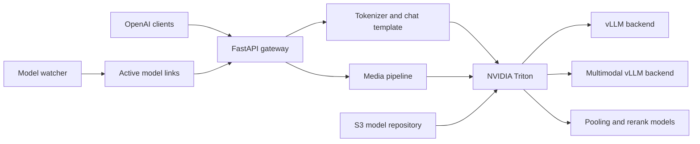

# Triton OpenAI Gateway

<div align="center">

**Язык:** [English](README.md) | Русский

**OpenAI-совместимый API и мультимодальная оркестрация для NVIDIA Triton и vLLM.**

[](LICENSE)
[](https://github.com/Raytorin/triton-openai-gateway/actions/workflows/ci.yml)
[](https://github.com/triton-inference-server/server)
[](https://github.com/vllm-project/vllm)
[](https://www.python.org/)
[](https://github.com/Raytorin)

[Кратко](#кратко-о-проекте) · [Зачем нужен проект](#зачем-нужен-проект) · [Возможности](#возможности) · [Быстрый старт](#быстрый-старт) · [Документация](#документация) · [Автор](#автор) · [Безопасность](#безопасность)

</div>

Triton OpenAI Gateway запускается рядом с NVIDIA Triton Inference Server и
предоставляет практичный OpenAI-совместимый API на порту `8080`. Он применяет
chat template модели, преобразует вызовы tools, обрабатывает большие
мультимодальные входы, добавляет очереди и наблюдаемость, не заменяя жизненный
цикл моделей Triton и планировщик vLLM.

Проект подходит, если Triton уже используется как среда инференса, а LiteLLM,
LibreChat, OpenAI SDK или внутренним приложениям нужен единый API для чат-моделей,
embeddings и reranking.

> Это независимый проект сообщества. Он не является продуктом NVIDIA и не
> аффилирован с NVIDIA.

> [!NOTE]
> Репозиторий содержит код gateway, backend и deployment. Он не включает веса
> моделей, не исполняет внешние tools и не предоставляет пользовательскую
> аутентификацию.

> **Проект оказался полезен?** Поставьте ему звезду на GitHub. Это поможет
> другим разработчикам найти проект и поддержит его дальнейшее развитие.

## Кратко о проекте

| Область | Что включено |
| --- | --- |
| Совместимость клиентов | OpenAI-совместимый API для LiteLLM, LibreChat, SDK и внутренних клиентов |
| Роли моделей | Text/VL chat, embeddings и reranking |
| Мультимодальные данные | Изображения, видео, аудио и PDF с контролируемой предобработкой |
| Runtime | NVIDIA Triton `26.07`, vLLM `0.24.0` и Python `3.12` |
| Эксплуатация | Очереди допуска, отмена запросов, структурированные логи, Prometheus и OTLP-трассировка |
| Развертывание | Docker-сборка с закреплённым digest и Helm charts для Kubernetes |

## Зачем нужен проект

Низкоуровневые endpoint-ы Triton ориентированы на модели. Клиентам LLM обычно
нужна дополнительная протокольная и оркестрационная логика:

| Проблема | Что добавляет gateway |
| --- | --- |
| vLLM получает уже подготовленный prompt | OpenAI `messages` и нативный chat template токенайзера |
| Ответ tool может быть в специфичном JSON или XML | OpenAI-совместимые `tool_calls`, включая XML Qwen3-Coder |
| Для разных media нет единого Triton input | Маршрутизация изображений, видео, аудио и PDF с ограничениями ресурсов |
| Большие PDF и видео не помещаются в один prompt | Text-first обработка, чанкинг map/reduce и опциональный PDF retrieval |
| Длинная история не помещается в context window | Rolling summary, детерминированное усечение или явный отказ для каждой модели |
| Потребителям rerank нужны разные правила отбора | Именованные стратегии по score, metadata, threshold и diversity |
| Reasoning-модели смешивают рассуждение и ответ | Настраиваемое скрытие или отдельное поле reasoning в JSON и SSE |
| Неограниченный поток клиентов может исчерпать память pod-а | Очереди по типам запросов, таймауты, отмена и HTTP `429` |
| По обычным логам сложно восстановить цепочку запроса | Request ID, структурированные логи, Prometheus и опциональный OTLP |
| S3 repository agent создаёт временные пути | Watcher исправляет пути vLLM и поддерживает ссылки активных моделей |

## Архитектура



Triton, watcher и gateway работают в одном контейнере. Выполнение модели,
continuous batching и параллелизм остаются внутри Triton/vLLM. Gateway отвечает
только за клиентский протокол, подготовку prompt, обработку media и управление
запросами.

## Возможности

- `POST /v1/chat/completions` с SSE streaming и отменой при отключении клиента.
- OpenAI function calling с разбором JSON и XML Qwen3-Coder.
- `POST /v1/embeddings` для pooling-моделей vLLM.
- `POST /rerank`, `/v1/rerank` и `/v2/rerank` для Triton rerank-моделей.
- Изображения, видео, аудио и PDF в OpenAI-style content parts.
- Map/reduce для больших документов и видео с настраиваемыми лимитами.
- Опциональный embedding retrieval для текстовых PDF.
- Политики переполнения контекста с rolling summary и контролируемым fallback.
- Настраиваемый отбор rerank после оценки всех кандидатов моделью.
- Политики reasoning со скрытым или отдельно возвращаемым рассуждением модели.
- Ограниченные глобальные и помаршрутные очереди.
- JSON, CEF или text logs с корреляцией по `X-Request-ID`.
- Интеграция с метриками gateway, Triton, vLLM, GPU/MIG и OpenTelemetry.
- Явные load/unload моделей из S3-репозитория Triton.
- Собственный backend `vllm_multimodal` для нативных media input vLLM.

Gateway **не выполняет tools самостоятельно**. Приложение получает функцию из
`tool_calls`, выполняет её и отправляет результат следующим сообщением с
`role: "tool"`.

## Совместимость

| Возможность | Triton `vllm` | Встроенный `vllm_multimodal` | Python backend |
| --- | --- | --- | --- |
| Текстовый чат и streaming | Да | Да | Зависит от модели |
| Tool calling | На уровне gateway | На уровне gateway | Зависит от модели |
| Изображения | Нативный input vLLM | Нативный input vLLM | Зависит от модели |
| Видео | Gateway извлекает и суммирует кадры | Нативно, если модель поддерживает видео | Зависит от модели |
| PDF | Text/vision map-reduce в gateway | Map/reduce в gateway; прямой запрос рендерит страницы | Зависит от модели |
| Аудио | Локальный ASR перед chat | Нативно, если модель поддерживает аудио | Зависит от модели |
| Embeddings | Да | Да | Да |
| Reranking | Зависит от модели | Зависит от модели | Да |

Нативная поддержка модальности зависит от архитектуры выбранной модели и версии
vLLM в образе. Например, vision-only модель не обработает аудио без отдельной
ASR-модели.

## Быстрый старт

### Требования

- Linux-сервер или Kubernetes-узел с поддерживаемой NVIDIA GPU.
- NVIDIA driver и Container Toolkit либо GPU Operator.
- Docker для сборки образа и Helm 3 для установки chart-а.
- Triton model repository. Веса моделей в этот репозиторий не входят.

### 1. Сборка образа

Базовый образ по умолчанию закреплён по digest и использует
`26.07-vllm-python-py3`.

```bash
docker build \
  -f Dockerfile.triton-gateway \
  -t triton-openai-gateway:26.07 .
```

Версии добавленных Python-зависимостей закреплены и проверяются во время сборки.

### 2. Подготовка модели

Для S3/remote repository используется стандартная структура Triton:

```text
model-repository/
└── Qwen3-Example/
    ├── config.pbtxt
    └── 1/
        ├── model.json
        ├── gateway.json        # опциональные настройки gateway
        ├── config.json
        ├── tokenizer_config.json
        └── веса модели...
```

Не добавляйте параметры gateway в `model.json`: vLLM воспринимает его ключи как
аргументы engine. Подробности находятся в [конфигурации](docs/configuration.ru.md)
и [примерах мультимодальной модели](examples/).

### 3. Запуск с Triton

Передайте параметры доступа, необходимые repository agent Triton, через файл
окружения и запустите общий образ:

```bash
docker run --rm --gpus all --shm-size=8g \
  --env-file .env \
  -p 8000:8000 -p 8001:8001 -p 8002:8002 -p 8080:8080 \
  triton-openai-gateway:26.07 \
  tritonserver \
  --model-repository=s3://S3_ENDPOINT/BUCKET/PREFIX \
  --model-control-mode=explicit \
  --strict-readiness=false
```

Для Kubernetes используйте встроенный Helm chart:

```bash
helm upgrade --install triton-openai-gateway ./helm/triton-gateway \
  --namespace inference --create-namespace \
  --set image.repository=REGISTRY/triton-openai-gateway \
  --set image.tag=26.07 \
  --set triton.modelRepository=s3://S3_ENDPOINT/BUCKET/PREFIX \
  --set s3.existingSecret=triton-s3-credentials
```

Перед production-развертыванием изучите [руководство Helm chart](helm/triton-gateway/README.ru.md),
особенно настройки GPU, хранилища, безопасности и метрик.

### 4. Загрузка модели и запрос

```bash
curl -fsS -X POST \
  http://127.0.0.1:8000/v2/repository/models/Qwen3-Example/load

curl -fsS http://127.0.0.1:8080/ready

curl -sS http://127.0.0.1:8080/v1/chat/completions \
  -H 'Content-Type: application/json' \
  -d '{
    "model": "Qwen3-Example",
    "messages": [{"role": "user", "content": "Объясни continuous batching."}],
    "temperature": 0.2,
    "max_tokens": 256
  }'
```

Готовые запросы для tools, изображений, видео, аудио, PDF, embeddings и rerank
находятся в [примерах API](examples/REQUEST_EXAMPLES.md).

## API

| Endpoint | Назначение |
| --- | --- |
| `GET /health` | Liveness gateway |
| `GET /ready` | Readiness gateway и Triton |
| `GET /metrics` | Prometheus-метрики gateway |
| `GET /docs` | Интерактивная OpenAPI-документация |
| `GET /v1/models` | Модели, известные Triton repository |
| `POST /v1/chat/completions` | Чат, tools и мультимодальные запросы |
| `POST /v1/embeddings` | Текстовые embeddings |
| `POST /rerank`, `/v1/rerank`, `/v2/rerank` | Reranking документов |

Raw Triton HTTP, gRPC и metrics остаются доступными на портах `8000`, `8001` и
`8002`.

## Документация

| Документ | Содержание |
| --- | --- |
| [Архитектура](docs/architecture.ru.md) | Компоненты и полные цепочки запросов |
| [Конфигурация](docs/configuration.ru.md) | Файлы модели, `gateway.json`, environment и Helm |
| [Эксплуатация](docs/operations.ru.md) | Health, метрики, логи, tracing и диагностика |
| [Миграция на Triton 26.07](docs/migration-26.07.ru.md) | Runtime pins, совместимость и production-проверка |
| [Примеры API](examples/REQUEST_EXAMPLES.md) | Чат, media, tools, embeddings и rerank |
| [Собственный backend](backends/vllm_multimodal/README.ru.md) | Контракт нативных мультимодальных input Triton |
| [Helm deployment](helm/triton-gateway/README.ru.md) | Установка в Kubernetes и основные values |
| [Участие в разработке](CONTRIBUTING.ru.md) | Процесс разработки и тестирования |
| [Авторы](AUTHORS.ru.md) | Авторство проекта и атрибуция участников |

## Безопасность

Gateway не содержит встроенной аутентификации. Оставляйте порты `8000`, `8001`,
`8002` и `8080` во внутренней сети, а пользовательский трафик направляйте через
аутентифицированный proxy или API gateway. Загрузка remote media по умолчанию
блокирует адреса приватных сетей, но оператор всё равно должен настроить лимиты
размера, media, очередей и таймаутов.

Перед публикацией сервиса изучите [SECURITY.ru.md](SECURITY.ru.md) и production
checklist в разделе [Эксплуатация](docs/operations.ru.md).

## Автор

Triton OpenAI Gateway создан
[Raytorin](https://github.com/Raytorin) и развивается при участии сообщества.
Сведения об авторстве и атрибуции зафиксированы в
[AUTHORS.ru.md](AUTHORS.ru.md), [CITATION.cff](CITATION.cff) и [NOTICE](NOTICE).

## Участие в разработке

Issues и pull requests приветствуются. Начните с
[CONTRIBUTING.ru.md](CONTRIBUTING.ru.md), сохраняйте исходные лицензионные
заголовки и добавляйте тесты для изменения поведения.

## Лицензия

Оригинальные исходники и документация проекта распространяются по
[Apache License 2.0](LICENSE). Файлы в `backends/vllm_multimodal/`, производные
от NVIDIA Triton vLLM backend, сохраняют уведомления BSD-3-Clause.

Образ, собранный через `Dockerfile.triton-gateway`, основан на NVIDIA Triton
NGC container и дополнительно подпадает под
[NVIDIA Software License Agreement](https://www.nvidia.com/en-us/agreements/enterprise-software/nvidia-software-license-agreement/),
[Product-Specific Terms for NVIDIA AI Products](https://www.nvidia.com/en-us/agreements/enterprise-software/product-specific-terms-for-ai-products/),
а также лицензии компонентов внутри базового образа. Перед распространением
исходников или собранного образа изучите [NOTICE](NOTICE) и
[THIRD_PARTY_NOTICES.md](THIRD_PARTY_NOTICES.md).
