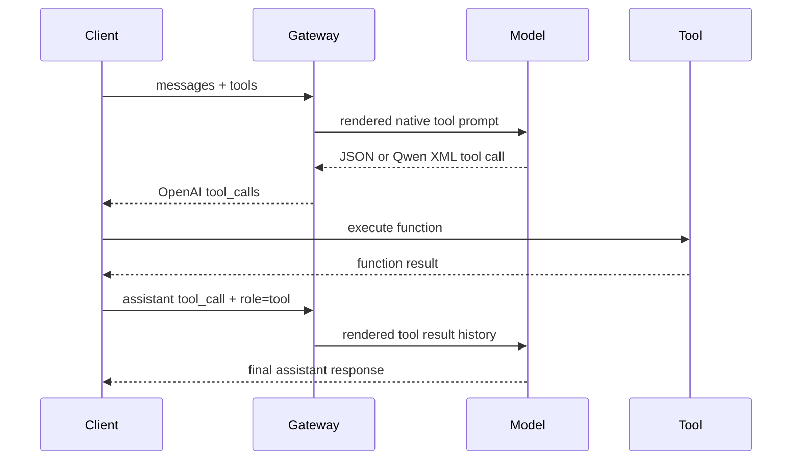

# Architecture

[Home](../README.md) / Architecture

**Language:** English | [Русский](architecture.ru.md)

Triton OpenAI Gateway is an in-container frontend for NVIDIA Triton. It keeps
model execution, continuous batching, parallelism, and model lifecycle inside
Triton and vLLM while adding the protocol behavior expected by OpenAI clients.

## Components

| Component | Responsibility |
| --- | --- |
| NVIDIA Triton | Model repository, load/unload, scheduling, inference, and base metrics |
| Triton vLLM backend | Text generation, pooling, continuous batching, and parallel execution |
| `vllm_multimodal` backend | The vLLM backend plus native image, video, audio, and PDF byte inputs |
| FastAPI gateway | OpenAI request/response translation, prompt rendering, media orchestration, and admission control |
| Model watcher | Repairs temporary S3 model paths and exposes active model directories to the gateway |

The Docker image starts the watcher and FastAPI application from NVIDIA's
`entrypoint.d` hooks, then the base image starts Triton as the main process.
Gateway-to-Triton traffic stays on loopback by default.

## Text Chat Flow

1. A client sends `POST /v1/chat/completions` with OpenAI-style `messages`.
2. Admission control reserves a slot or places the request in a bounded queue.
3. The registry resolves `/tmp/models-active/<model>`.
4. The gateway loads or reuses the model tokenizer.
5. `tokenizer.apply_chat_template(...)` renders the prompt, tools, and tool
   history in the model's native format.
6. Context-window handling removes the oldest eligible turns if the prompt plus
   requested output cannot fit in `max_model_len`.
7. The gateway opens a decoupled Triton gRPC stream for the vLLM model.
8. Triton/vLLM performs scheduling and generation.
9. The gateway converts the result to an OpenAI response or SSE stream.
10. Client disconnects cancel the corresponding Triton stream and release the
    admission slot.

The gateway does not implement its own generation scheduler and does not split
one vLLM engine across gateway workers.

## Tool Calling Flow

The client or orchestration layer owns tool execution. The gateway only renders
tool definitions and history, then normalizes model output. Model-local parser
files are detected as compatibility signals but are not imported or executed.

## Multimodal Routing

The gateway identifies media by content-part type, MIME type, filename, data URL
header, and file signature. This allows a PDF or video placed in a generic file
or image content part to be routed correctly.

### Stock `vllm` Backend

- Images are sent through Triton's supported `image` input.
- Videos are sampled across their duration and analyzed as bounded frame chunks.
- Text PDFs use text extraction first; scanned PDFs are rendered into bounded
  page-image chunks.
- Audio is transcribed by a configured local ASR model before chat inference.
- Intermediate chunk answers are reduced until the final context fits.

### Included `vllm_multimodal` Backend

- Image, video, and audio bytes cross the local Triton gRPC boundary directly.
- CPU-heavy decoding runs outside the vLLM event loop with a concurrency limit.
- Video is decoded into frames plus the metadata required by vLLM renderers.
- Audio is passed as a waveform only when the model architecture supports audio.
- Direct Triton PDF calls render pages; the OpenAI endpoint still uses gateway
  map/reduce so large documents do not have to fit in one engine request.

Remote URLs are fetched and validated by the gateway. The backend itself does
not access the network.

## PDF Processing

For an OpenAI chat request, PDF handling is selected per document:

1. Extract text and inspect readability.
2. Use text map/reduce for readable documents.
3. If an embedding model is configured and the question is targeted, chunk the
   text, retrieve relevant chunks, and send only those chunks to the chat model.
4. Render pages for scans, image-heavy files, or explicit visual mode.
5. Process bounded chunks concurrently.
6. Reduce intermediate summaries in bounded groups.
7. Produce one answer grounded in the complete processed document.

Embedding vectors are held in a bounded process-local LRU cache. This is an
optimization, not a persistent vector database.

## Media History

When a new attachment arrives, `gateway.json` can keep text history while making
the latest media the primary source. Old media payloads are removed from the
prompt, and prior media answers can be replaced with neutral markers. This
prevents an earlier image or document from being mistaken for the current file
without discarding unrelated conversation history.

See `media_history_mode`, `focus_current_media`, and
`media_history_max_tokens` in [Configuration](configuration.md).

## Backpressure

Admission control has a global limiter and route-specific limiters for chat,
media, embeddings, and rerank. Each limiter has:

- a maximum number of in-flight requests;
- a bounded FIFO wait queue;
- a queue timeout;
- rejection metrics and an HTTP `429` response when capacity is exhausted.

For streaming responses, the slot remains reserved until generation completes
or the client disconnects. This avoids accepting more work than the pod can
retain safely in memory.

## Model Discovery

Triton's S3 repository agent materializes a model version into a temporary path
such as `/tmp/folderAbCd/1`. The watcher:

1. waits for a numeric version containing `model.json` or `model.py`;
2. rewrites the temporary `model.json` model path to that real directory;
3. points GGUF models to the actual `.gguf` file;
4. removes engine arguments known to be incompatible with the pinned vLLM;
5. creates `/tmp/models-active/<model>` for tokenizer and gateway config access;
6. removes stale links after unload.

The source model repository is never modified. Only Triton's temporary checkout
is changed.

## Observability Path

Every gateway request receives or preserves an `X-Request-ID`. The same value is
attached to gateway logs and propagated to Triton where the transport supports
it. Operators can combine:

- gateway Prometheus metrics on `:8080/metrics`;
- Triton and custom vLLM metrics on `:8002/metrics`;
- DCGM Exporter GPU/MIG metrics on `:9400/metrics`;
- JSON, CEF, or text logs;
- optional Triton OTLP traces.

See [Operations](operations.md) for endpoints and production guidance.

## Source Map

| Path | Purpose |
| --- | --- |
| `gateway/app.py` | HTTP routes and top-level request orchestration |
| `gateway/prompt.py` | Chat template and context-window handling |
| `gateway/multimodal.py` | Content-part parsing and media-history scoping |
| `gateway/vllm_media.py` | PDF, video, and audio map/reduce pipelines |
| `gateway/triton_client.py` | Triton HTTP and asynchronous gRPC clients |
| `gateway/admission.py` | Bounded queues and request limits |
| `gateway/observability.py` | Structured logs and request context |
| `backends/vllm_multimodal/` | Extended Triton vLLM backend |
| `watch_triton.sh` | Temporary repository synchronization |
