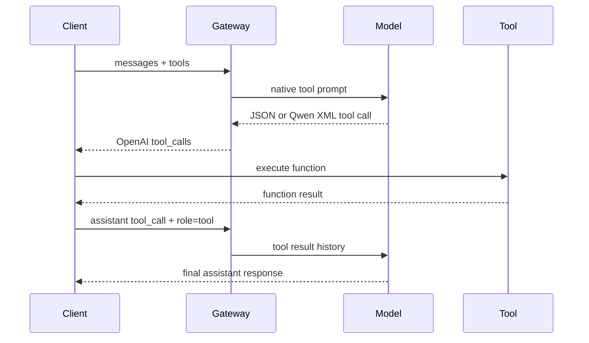

# Архитектура

[Главная](../README.ru.md) / Архитектура

**Язык:** [English](architecture.md) | Русский

Triton OpenAI Gateway является frontend-слоем внутри контейнера NVIDIA Triton.
Выполнение моделей, continuous batching, параллелизм и жизненный цикл моделей
остаются в Triton и vLLM. Gateway добавляет поведение протокола, которое ожидают
OpenAI-совместимые клиенты.

## Компоненты

| Компонент | Ответственность |
| --- | --- |
| NVIDIA Triton | Model repository, load/unload, scheduling, inference и базовые метрики |
| Triton vLLM backend | Генерация текста, pooling, continuous batching и параллельное выполнение |
| `vllm_multimodal` backend | Возможности vLLM backend плюс нативные input изображений, видео, аудио и PDF |
| FastAPI gateway | Преобразование OpenAI-запросов, prompt rendering, media orchestration и admission control |
| Model watcher | Исправление временных S3-путей и публикация директорий активных моделей |

Docker-образ запускает watcher и FastAPI через хуки NVIDIA `entrypoint.d`, после
чего базовый entrypoint запускает Triton как основной процесс. По умолчанию весь
трафик между gateway и Triton проходит через loopback.

## Цепочка текстового чата

1. Клиент отправляет `POST /v1/chat/completions` с OpenAI-style `messages`.
2. Admission control выделяет slot или помещает запрос в ограниченную очередь.
3. Registry разрешает путь `<watcher-root>/models-active/<model>`.
4. Gateway загружает или повторно использует токенайзер модели.
5. `tokenizer.apply_chat_template(...)` формирует prompt, tools и tool history в
   нативном формате модели.
6. Политика context window сохраняет prompt, суммирует старые полные turn-ы,
   удаляет их или отклоняет запрос в соответствии с `gateway.json`.
7. Gateway открывает decoupled gRPC stream к vLLM-модели в Triton.
8. Triton/vLLM выполняет scheduling и генерацию.
9. Gateway отделяет настроенный reasoning, нормализует tool calls и преобразует
   результат в OpenAI response или SSE stream.
10. При отключении клиента соответствующий Triton stream отменяется, а admission
    slot освобождается.

Gateway не реализует собственный планировщик генерации и не распределяет один
vLLM engine между своими worker-ами.

## Цепочка Tool Calling

Выполнение tool принадлежит клиенту или внешнему orchestration-слою. Gateway
только формирует описание tools и историю, а затем нормализует ответ модели.
Parser-файлы рядом с моделью используются как сигнал совместимости, но не
импортируются и не исполняются.

## Маршрутизация мультимодальных данных

Gateway определяет тип media по content-part, MIME type, имени файла, заголовку
data URL и сигнатуре содержимого. Поэтому PDF или видео, ошибочно отправленные в
универсальном file- или image-блоке, могут быть перенаправлены корректно.

### Штатный backend `vllm`

- Изображения передаются через поддерживаемый Triton input `image`.
- Видео равномерно семплируется по длительности и анализируется ограниченными
  чанками кадров.
- Текстовые PDF сначала обрабатываются как текст, а сканированные документы
  рендерятся в ограниченные чанки изображений страниц.
- Аудио транскрибируется настроенной локальной ASR-моделью до chat inference.
- Промежуточные ответы по чанкам сокращаются, пока итоговый контекст не
  поместится в модель.

### Встроенный backend `vllm_multimodal`

- Байты изображений, видео и аудио передаются напрямую через локальный Triton
  gRPC.
- CPU-декодирование выполняется вне event loop vLLM с ограничением concurrency.
- Видео преобразуется в кадры и metadata, необходимые renderer-у vLLM.
- Аудио передаётся как waveform только для архитектур с поддержкой аудио.
- Прямой Triton-запрос с PDF рендерит страницы; OpenAI endpoint всё равно
  использует map/reduce, чтобы большой документ не обязан был помещаться в один
  запрос engine.

Remote URL скачивает и проверяет gateway. Сам backend не обращается в сеть.

## Обработка PDF

Для OpenAI chat-запроса способ обработки выбирается для каждого документа:

1. Извлечь текст и оценить его читаемость.
2. Использовать text map/reduce для текстового документа.
3. Если настроена embedding-модель и вопрос является точечным, разбить текст,
   найти релевантные чанки и отправить chat-модели только их.
4. Рендерить страницы для сканов, image-heavy документов или режима `visual`.
5. Обработать ограниченные чанки с настроенной concurrency.
6. Сокращать промежуточные результаты ограниченными группами.
7. Сформировать один ответ по всей обработанной информации документа.

Embedding-векторы хранятся в ограниченном process-local LRU cache. Это
оптимизация, а не постоянная векторная база данных.

## История media

При появлении нового вложения `gateway.json` позволяет сохранить текстовую
историю, но назначить новое media главным источником. Старые media payload
удаляются из prompt, а прошлые ответы по вложениям могут заменяться нейтральными
маркерами. Это не даёт модели перепутать прошлое изображение или документ с
текущим, не удаляя независимую историю диалога.

Смотрите `media_history_mode`, `focus_current_media` и
`media_history_max_tokens` в разделе [Конфигурация](configuration.ru.md).

## Backpressure

Admission control содержит глобальный limiter и отдельные limiter-ы для chat,
media, embeddings и rerank. Каждый limiter задаёт:

- максимальное число выполняемых запросов;
- ограниченную FIFO-очередь ожидания;
- таймаут ожидания;
- метрики отказов и HTTP `429` при исчерпании ёмкости.

Для streaming response slot удерживается до завершения генерации или отключения
клиента. Это предотвращает приём большего объёма работы, чем pod способен
безопасно удерживать в памяти.

## Обнаружение моделей

S3 repository agent Triton материализует версию модели во временный путь,
например `<watcher-root>/folderAbCd/1`. Корень выбирается из
`WATCHER_MODEL_DIR`, совместимого alias `TMP_ROOT`, `TMPDIR` Triton или
`/tmp`. Watcher:

1. ожидает числовую версию с `model.json` или `model.py`;
2. переписывает путь модели во временном `model.json` на реальную директорию;
3. для GGUF указывает конкретный `.gguf` файл;
4. удаляет engine arguments, несовместимые с закреплённой версией vLLM;
5. создаёт `<watcher-root>/models-active/<model>` для доступа к tokenizer и gateway config;
6. удаляет устаревшие ссылки после unload.

Исходный model repository не изменяется. Меняется только временная копия Triton.

## Наблюдаемость

Каждый запрос gateway получает новый или сохраняет переданный `X-Request-ID`.
Значение попадает в логи gateway и передаётся в Triton там, где это поддерживает
transport. Оператор может объединить:

- Prometheus-метрики gateway на `:8080/metrics`;
- Triton и custom vLLM metrics на `:8002/metrics`;
- GPU/MIG-метрики DCGM Exporter на `:9400/metrics`;
- JSON, CEF или text logs;
- опциональные OTLP traces Triton.

Endpoint-ы и production-рекомендации описаны в разделе
[Эксплуатация](operations.ru.md).

## Карта исходного кода

| Путь | Назначение |
| --- | --- |
| `gateway/app.py` | HTTP routes и верхнеуровневая orchestration запросов |
| `gateway/prompt.py` | Chat template и управление контекстным окном |
| `gateway/multimodal.py` | Разбор content parts и управление media history |
| `gateway/vllm_media.py` | Map/reduce pipeline для PDF, видео и аудио |
| `gateway/triton_client.py` | Triton HTTP и асинхронный gRPC client |
| `gateway/admission.py` | Ограниченные очереди и лимиты запросов |
| `gateway/observability.py` | Структурированные логи и request context |
| `backends/vllm_multimodal/` | Расширенный Triton vLLM backend |
| `watch_triton.sh` | Синхронизация временного model repository |
